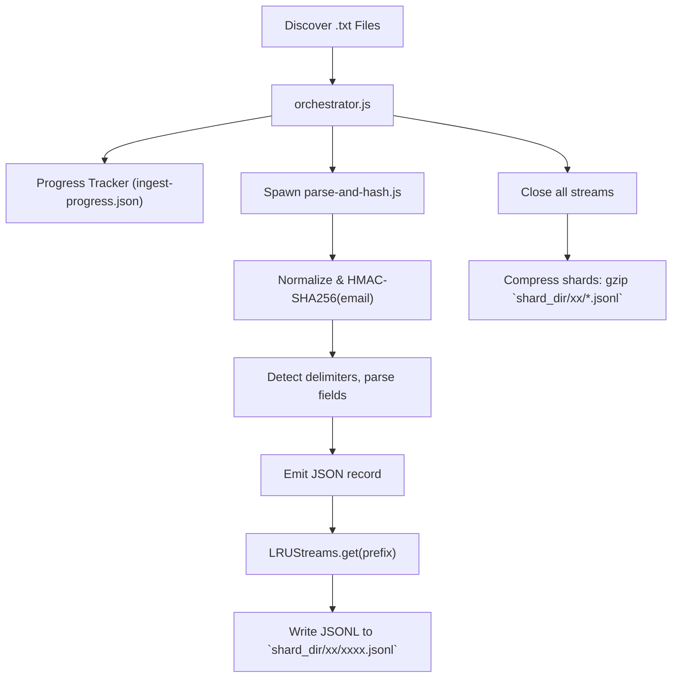

# AntiPublic Prefix-Sharded Ingestion Service

A resilient, prefix-sharded ingestion pipeline for large static breach dumps, optimized for low-resource environments (e.g., Raspberry Pi + NAS). It:

- **HMAC-hashes** and normalizes emails for privacy  
- **Supports** colon (`:`), semicolon (`;`), and whitespace delimiters  
- **Shards** records into 256 subdirectories by the first two hex characters of the email hash  
- **Logs** files with entries containing more than two fields to `multi_field_files.log` for manual review  
- Uses an **LRU stream cache** to cap open file descriptors (`MAX_STREAMS`). This is necessary to limit the number of open file handles while the ingestion process is running.  
- Is **resumable** and **crash-resilient** via per-file progress tracking  
- Generates compressed `*.jsonl.gz` files for **O(1)** lookups  

This application is used to ingest an input directory of text files to generate structured json shards as output.
Breach compilations are massive in size and using grep for lookups is not practical. To solve this problem it is broken down into two smaller ones:

- Ingestion; what this application does
- Lookup

To index the breach data:
- The email address of every entry is hashed using a 32-byte key.
- The first 4 characters of the hashed email hex value is then used for indexing the output.
- All hashed emails which begin with the same 4 characters are stored in the same output shard file.
- This design inherently means the application will generate up to 65,536 shards
- Almost every OS would struggle handling a directory with 65,536 files, therefore the application generates a folder structure of 256 subdirectories, each of which would hold up to 256 shards.
- The subdirectory name is the first 2 characters of the hashed email hexadecimal value.
- This makes up for the entire output shard population (256 * 256 = 65,536)
- This indexing makes it a lot faster to lookup an entry.
- A lookup application would need to hash the input email address with the same 32-byte key, then locate the corresponding shard using the first 2 characters to locate the subdirectory, then the first 4 characters to load the shard file.
- The lookup application would then need to perform a sequencial search on the shard file to find all matches to the input hashed email address value.

This indexing mechanism was devised - as opposed to ELK stack or relational databases - to allow the ingestion and lookup applications to run on limited-resources hardware like a Raspberry Pi attached to a NAS drive or external SSD.

---

## Architecture



---

## Components

- **`orchestrator.js`**  
- **`parse-and-hash.js`**  
- **`package.json`**  
- **`.env`**  
- **`ingest-progress.json`**  
- **`multi_field_files.log`**  
- **`ecosystem.config.cjs`** (optional)  
- **`.gitignore`**

---

## Prerequisites

- **Node.js ≥14** and **npm**  
- Read/write access to `INPUT_DIR` and `SHARD_DIR`  
- **PM2** for process management (optional but recommended)  

---

## Installation

```bash
git clone <repo-url> .
npm install
```

### Installing PM2

To install PM2 globally:

```bash
npm install -g pm2
```

Verify installation:

```bash
pm2 -v
```

---

## Configuration

1. Create a `.env` file in the project root:

   ```dotenv
   EMAIL_HASH_KEY=<hex-encoded 32-byte key>
   INPUT_DIR=/mnt/Torrents/WDHome/breaches
   SHARD_DIR=/mnt/Torrents/WDHome/data/shards
   MAX_STREAMS=100
   ```
2. Ensure `SHARD_DIR` exists and is writable:

   ```bash
   mkdir -p "$SHARD_DIR"
   sudo chown -R $(whoami):$(whoami) "$SHARD_DIR"
   ```

3. (Optional) Customize `ecosystem.config.cjs` for PM2:

   ```js
   module.exports = {
     apps: [{
       name: 'ingest-orchestrator',
       script: 'orchestrator.js',
       interpreter: 'bash',
       interpreter_args: '-c "nice -n 10 ionice -c2 -n7 node orchestrator.js"',
       log_date_format: 'YYYY-MM-DD HH:mm Z',
       autorestart: true,
       watch: false
     }]
   };
   ```

---

## Running Ingestion

### With npm

```bash
npm run ingest
```

### With PM2

```bash
npm start            # Starts via ecosystem.config.cjs
pm2 save             # Save process list
pm2 startup systemd  # Generate startup script
```

---

## Verifying Status & Logs

- **List processes**: `pm2 list` or `npm run status`  
- **Realtime logs**: `pm2 logs ingest-orchestrator` or `npm run logs`  
- **Error-only logs**:

  ```bash
  tail -f ~/.pm2/logs/ingest-orchestrator-error.log
  ```

- **Progress**: View `ingest-progress.json`  
- **Multi-field files**: Check `multi_field_files.log`  

---

## Robustness & Resilience

- **Resumable**: Skips files marked `done`  
- **Crash-resistant**: Progress saved after every file  
- **FD control**: LRUStreams limits open descriptors  
- **Flexible parsing**: Supports `:`, `;`, and whitespace delimiters  
- **Additive schema**: Consumers handle missing/new fields gracefully  

---

## Troubleshooting

- **Permission issues**: Check mount options, ownership, `uid`/`gid` in `/etc/fstab`.  
- **Malformed progress**: Reset `ingest-progress.json` to `{}` if corrupted.  
- **PM2 startup**: If `pm2 startup` prompts, copy the printed command and run with `sudo`.  

---

## License

MIT © Akram Zaki
